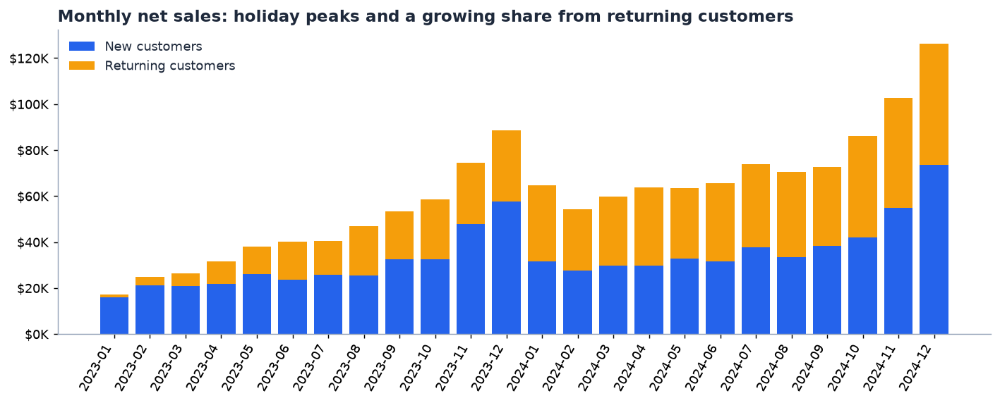
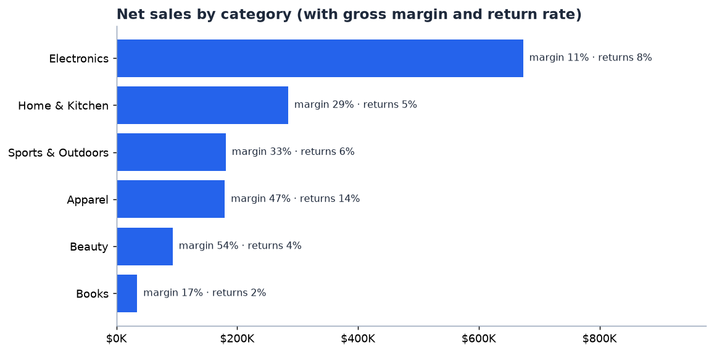
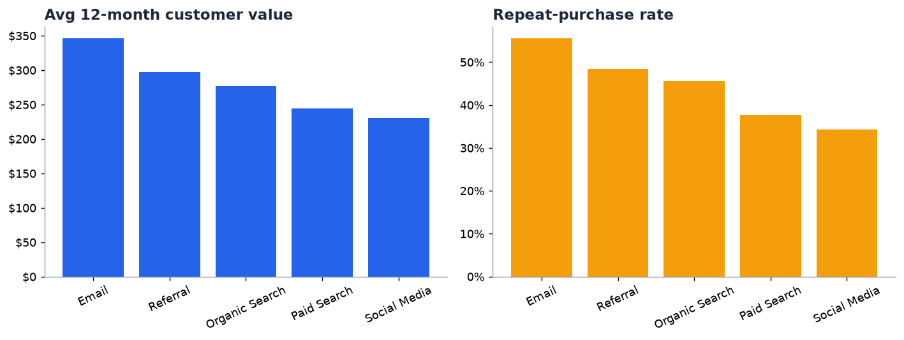
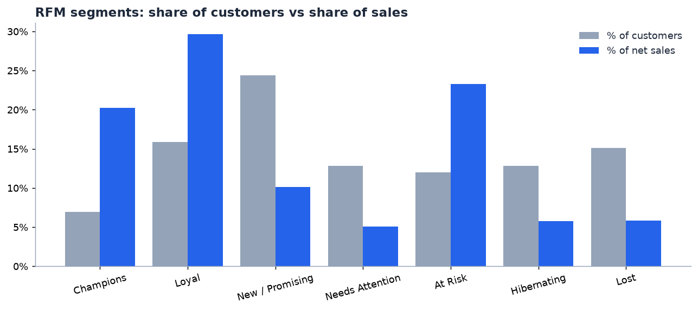
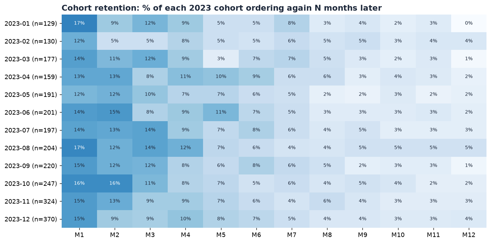
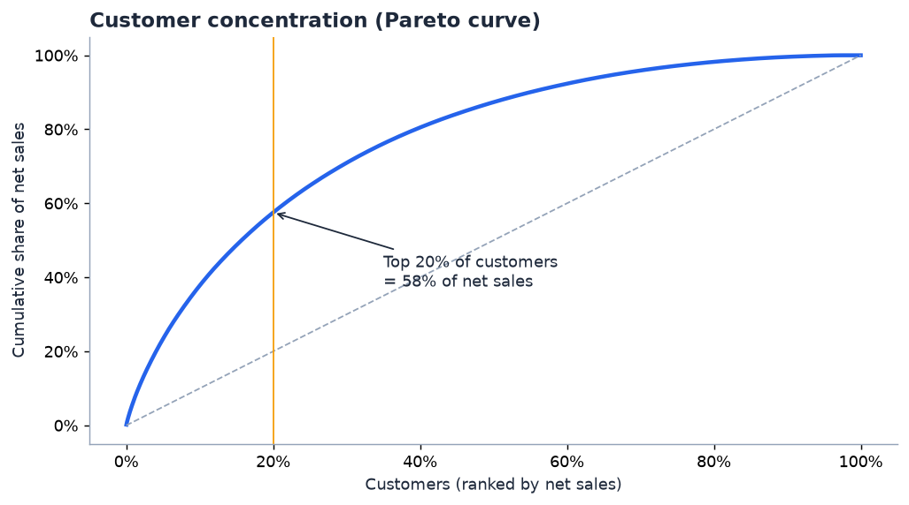
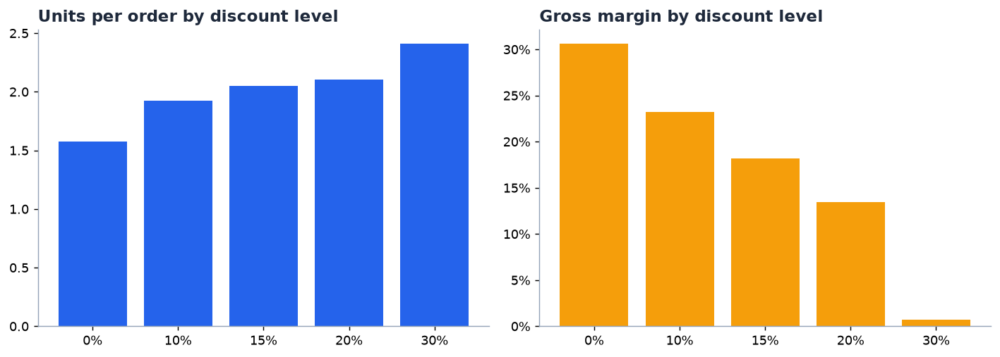

# E-Commerce Sales & Customer Analytics

End-to-end analysis of two years (Jan 2023 – Dec 2024) of online-store transactions: **10.8K orders, 5.9K customers, $1.44M in net sales**. The project covers data cleaning, KPI reporting, customer segmentation (RFM), cohort retention, profitability by category and channel, and discount effectiveness. It ends with concrete business recommendations.

**Tools:** Python (pandas, matplotlib) · SQL (SQLite window functions and CTEs) · Excel (dashboard with native charts and conditional formatting) · HTML/Chart.js (interactive dashboard on GitHub Pages)

| Deliverable | Where |
|---|---|
| Interactive dashboard | [`docs/index.html`](docs/index.html) → live at `https://github.com/JosheCapu/Ecommerce-Sales-Analytics` |
| Excel workbook (dashboard + 11 analysis sheets) | [`outputs/ecommerce_analytics.xlsx`](outputs/ecommerce_analytics.xlsx) |
| Analysis pipeline | [`analysis.py`](analysis.py) |
| SQL queries | [`sql/analysis_queries.sql`](sql/analysis_queries.sql) → results in [`outputs/sql/`](outputs/sql) |
| Charts | [`images/`](images) |

---

## Executive summary

| KPI | 2023 | 2024 | Change |
|---|---:|---:|---:|
| Net sales | $540.5K | $904.2K | **+67.3%** |
| Orders | 4,053 | 6,723 | +65.9% |
| Active customers | 2,549 | 3,944 | +54.7% |
| Avg order value | $133.37 | $134.49 | +0.8% |
| Gross margin | 25.1% | 24.4% | −0.7 pp |
| Repeat customer rate | 35.6% | 39.7% | +4.1 pp |
| Return rate (% of sales) | 7.5% | 7.7% | +0.2 pp |

**Takeaways:**
1. **Growth came from more customers and more repeat orders, not bigger baskets.** AOV was flat (+0.8%). Returning customers' share of sales rose from **35% to 49%**.
2. **Electronics brings in 47% of sales but only 21% of gross profit** (11% margin). Home & Kitchen and Apparel each earn more profit on less than half the revenue.
3. **Deep discounts don't pay.** Orders at a 30% discount earned **$0.96 gross profit per order**, against $39.54 at full price.
4. **Channel quality varies a lot.** An Email customer is worth **$346 in their first 12 months**, against $230 for Social Media (+50%).
5. **$337K of past revenue sits in the "At Risk" segment.** These 707 customers (12% of the base) used to buy often and haven't ordered in about 15 months on average.
6. **57% of customers never place a second order.** Retention falls to 15% in month 1 and 2.5% by month 12, so the first 60 days are where retention is won or lost.

---

## Business questions

1. How are sales trending, and what's driving growth?
2. Which categories and products drive revenue, and which drive profit?
3. Which acquisition channels bring the most valuable customers?
4. Who are our best customers, and who are we about to lose?
5. How well do we retain customers after their first purchase?
6. Are discounts helping or hurting the business?

## Dataset

Four relational tables, modelled on a typical e-commerce OLTP export:

| Table | Rows | Key columns |
|---|---:|---|
| `customers` | 6,000 | customer_id, signup_date, acquisition_channel, region |
| `products` | 300 | product_id, product_name, category, unit_price, unit_cost |
| `orders` | 11,197 (raw) | order_id, customer_id, order_date, status, discount_pct |
| `order_items` | 16,709 | order_id, product_id, quantity, unit_price, returned |

> **Note on data:** The data is **synthetic**, produced by [`data/generate_data.py`](data/generate_data.py) (seeded, so it's fully reproducible). It was built to behave like real e-commerce data: trend and holiday seasonality, heavy-tailed customer value, channel-dependent loyalty, and category-level margin and return differences. It also contains **deliberate data-quality problems** so the cleaning step does real work. The analysis code is dataset-agnostic, so you could point it at a real export with the same schema.

## Methodology

### 1. Data cleaning

| Issue | Table | Rows | Fix |
|---|---|---:|---|
| Exact duplicate rows | orders | 111 | Dropped |
| Non-ISO date format (e.g. `05-Mar-2024`) | orders | 332 | Parsed to ISO dates |
| Inconsistent region casing/whitespace (`" west "`, `WEST`) | customers | 179 | Trimmed + title-cased |
| Missing region | customers | 60 | Labelled `Unknown` (kept, since they're still paying customers) |
| Zero/negative quantity | order_items | 40 | Dropped as invalid lines |
| Missing unit price | order_items | 50 | Filled from the product catalog |
| Cancelled orders | orders | 293 | Excluded from sales metrics |

### 2. Metric definitions

- **Gross sales** = quantity × unit price × (1 − order discount)
- **Net sales** = gross sales − returned lines (returns are refunded)
- **Gross profit** = net sales − cost of goods for non-returned lines
- **AOV** = net sales ÷ completed orders
- **Repeat customer rate** = share of customers with 2+ orders in the period
- **12-month customer value** = net sales in a customer's first 365 days. It only counts customers acquired at least 365 days before the data ends, so recent signups don't drag the average down unfairly.

### 3. Techniques

- **RFM segmentation.** Recency is scored as quintiles (5 = most recent). Frequency uses fixed buckets (1 / 2 / 3 / 4–5 / 6+ orders), because 57% of customers ordered once and quantiles would split identical customers at random. Monetary is scored as quintiles. Segments come from R and the average of F and M.
- **Cohort retention.** Customers are grouped by the month of their first order. The table shows the share who ordered again 1, 2, … months later.
- **Pareto analysis.** Cumulative share of net sales by customer rank.
- **SQL validation.** The core questions are re-answered in SQLite using a reusable view, CTEs and window functions (`LAG` for YoY growth, `RANK` for customer ranking). The pipeline **asserts that SQL and pandas agree on total net sales**.

---

## Findings

### 1. Sales trend: strong growth with a holiday peak



- Net sales grew **+67% YoY**, from $540K to $904K. December 2024 was the best month at **$126K**.
- Nov–Dec made up **30% of 2023 sales** but **25% of 2024 sales**, so the business is becoming less dependent on the holidays.
- **Returning customers went from 35% to 49% of sales.** This is the healthiest growth signal in the data, because repeat revenue costs far less to acquire.

### 2. Category profitability: revenue ≠ profit



| Category | Share of sales | Gross margin | Return rate | Share of profit |
|---|---:|---:|---:|---:|
| Electronics | 46.6% | 11.0% | 8.1% | 20.8% |
| Home & Kitchen | 19.7% | 29.5% | 4.9% | **23.5%** |
| Sports & Outdoors | 12.5% | 32.8% | 6.3% | 16.6% |
| Apparel | 12.4% | 46.5% | **13.9%** | 23.4% |
| Beauty | 6.4% | 53.7% | 3.8% | 14.0% |
| Books | 2.4% | 17.3% | 1.7% | 1.7% |

- Electronics dominates revenue, and the whole top-10 product list is Electronics (see `outputs/sql/q2.csv`). After discounts, though, it keeps only 11 cents of every dollar.
- **Apparel has the highest return rate (14%)** yet still produces 23% of profit. Cutting its returns is the cheapest margin win available.

### 3. Acquisition channels: not all customers are equal



| Channel | Customers | Repeat rate | 12-month value |
|---|---:|---:|---:|
| Email | 580 | 55.5% | **$346** |
| Referral | 856 | 48.5% | $297 |
| Organic Search | 1,774 | 45.5% | $277 |
| Paid Search | 1,440 | 37.7% | $244 |
| Social Media | 1,229 | 34.3% | $230 |

Email and Referral customers come back more often and spend more. Paid Search and Social bring volume but lower-value customers. Those two channels also cost money per acquisition, so their true ROI gap is even wider than shown here.

### 4. Customer segments (RFM)



| Segment | Customers | % customers | % sales | Avg orders | Avg days since last order |
|---|---:|---:|---:|---:|---:|
| Champions | 410 | 7.0% | 20.3% | 4.7 | 64 |
| Loyal | 935 | 15.9% | 29.7% | 2.6 | 137 |
| New / Promising | 1,433 | 24.4% | 10.1% | 1.2 | 60 |
| Needs Attention | 753 | 12.8% | 5.1% | 1.2 | 233 |
| **At Risk** | **707** | **12.0%** | **23.3%** | 2.6 | **450** |
| Hibernating | 754 | 12.8% | 5.8% | 1.2 | 384 |
| Lost | 887 | 15.1% | 5.8% | 1.1 | 579 |

- **Champions + Loyal = 23% of customers → 50% of sales.**
- **At Risk is the priority.** These are proven repeat buyers (2.6 orders on average) who have gone quiet for about 15 months, and they account for $337K of historical sales. Winning them back is cheaper than acquiring new customers.

### 5. Retention: the second order is the hardest



- On average, only **14.7%** of a cohort buys again in month 1, **9.2%** in month 4 and **2.5%** in month 12.
- **57% of customers are one-time buyers.** Most of the loss happens right after the first purchase, which makes a post-purchase nurture flow the most important retention lever.
- Holiday cohorts (Nov/Dec) are the largest but retain no better than other months. Many of those customers are gift or deal shoppers.

### 6. Revenue concentration



The **top 10% of customers generate 38% of net sales, and the top 20% generate 58%**. That's a classic Pareto pattern: losing a small number of high-value customers would hurt revenue noticeably.

### 7. Discount effectiveness



| Discount | % of orders | Units/order | AOV | Gross margin | Profit/order |
|---|---:|---:|---:|---:|---:|
| 0% | 59.1% | 1.58 | $129 | 30.6% | $39.54 |
| 10% | 15.4% | 1.92 | $141 | 23.2% | $32.76 |
| 15% | 10.1% | 2.05 | $142 | 18.2% | $25.79 |
| 20% | 10.6% | 2.10 | $141 | 13.4% | $18.88 |
| 30% | 4.8% | 2.41 | $141 | **0.7%** | **$0.96** |

Discounts do grow the basket (+53% units at 30% off), but the lower price cancels that out. AOV plateaus around $141 while margin collapses. **At 30% off, the business essentially sells at cost.**

---

## Recommendations

| # | Action | Why | Estimated impact |
|---|---|---|---|
| 1 | **Cap promotions at 15–20%.** Replace 30% codes with bundles or free-shipping thresholds. | 30% orders earn $0.96 profit each | About **+$9K gross profit/yr** if those 517 orders had been placed at 20% off (assumes the same volume) |
| 2 | **Run a win-back campaign for the At Risk segment** (personalised offer, "we miss you" email series). | 707 proven buyers, $337K of historical sales | Every 10% reactivated at the current AOV adds about $9.5K per order cycle |
| 3 | **Build a second-purchase flow** (day 7 / 21 / 45 emails, cross-sell, loyalty points). | 57% never reorder, and month-1 retention halves by month 5 | Each +1 pp of repeat rate ≈ 59 more repeat customers |
| 4 | **Rebalance acquisition spend** toward Referral (launch a referral program) and email list growth. | Email/Referral customers are worth 22–50% more than Paid/Social customers | Higher LTV per acquired customer |
| 5 | **Fix Electronics margin.** Discount Electronics less and attach high-margin accessories. | 47% of sales, 21% of profit | Each +1 pp of Electronics margin ≈ +$6.7K profit |
| 6 | **Reduce Apparel returns** with size guides, fit reviews and better product photos. | 14% return rate, the highest of any category | Halving returns recovers about $14K in net sales |

## Limitations & next steps

- The data is synthetic, so the absolute numbers are illustrative. The methods and the pipeline carry over directly to real data.
- There's no marketing-cost data, so channel ROI and CAC:LTV can't be computed. That's the natural next step.
- The discount analysis is correlational. Holiday orders carry both deeper discounts and different buying behaviour, so an **A/B test** would be needed to prove causation.
- Possible extensions: churn-prediction model, market-basket analysis (what sells together), and a Power BI/Tableau version of the dashboard.

---

## How to run

```bash
pip install -r requirements.txt
python data/generate_data.py   # regenerate raw CSVs (optional, already included)
python analysis.py             # clean, analyse, and rebuild charts, Excel and the dashboard data
```

Open `docs/index.html` in a browser to view the dashboard locally, or enable GitHub Pages on the `docs/` folder (Settings → Pages → Branch: `main`, folder: `/docs`).

## Project structure

```
ecommerce-sales-analytics/
├── data/
│   ├── generate_data.py          # reproducible synthetic dataset generator
│   └── raw/                      # customers, products, orders, order_items (CSV)
├── sql/analysis_queries.sql      # view + 5 business queries (CTEs, LAG, RANK)
├── analysis.py                   # full pipeline: clean → analyse → export
├── images/                       # charts used in this README
├── outputs/
│   ├── ecommerce_analytics.xlsx  # Excel dashboard + analysis sheets
│   └── sql/                      # SQL query results (CSV)
├── docs/                         # interactive dashboard (GitHub Pages)
│   ├── index.html
│   └── data.js                   # generated by analysis.py
└── requirements.txt
```

### Excel workbook contents

| Sheet | What's in it |
|---|---|
| **Dashboard** | KPI tiles (formula-linked to the KPIs sheet) and 5 native Excel charts |
| KPIs | All/2023/2024 KPIs with YoY change |
| Monthly Trend | Net sales, orders, AOV, new vs returning sales, YoY growth |
| Categories / Top Products | Sales, margin, return rate, profit share |
| Channels / Regions | Customers, repeat rate, 12-month value |
| RFM Segments / Customer RFM | Segment summary plus a scored table for all 5,879 customers |
| Cohort Retention | Cohort matrix with a colour-scale heatmap |
| Discounts | Units, AOV, margin and profit per order by discount level |
| Data Quality | Cleaning log |
